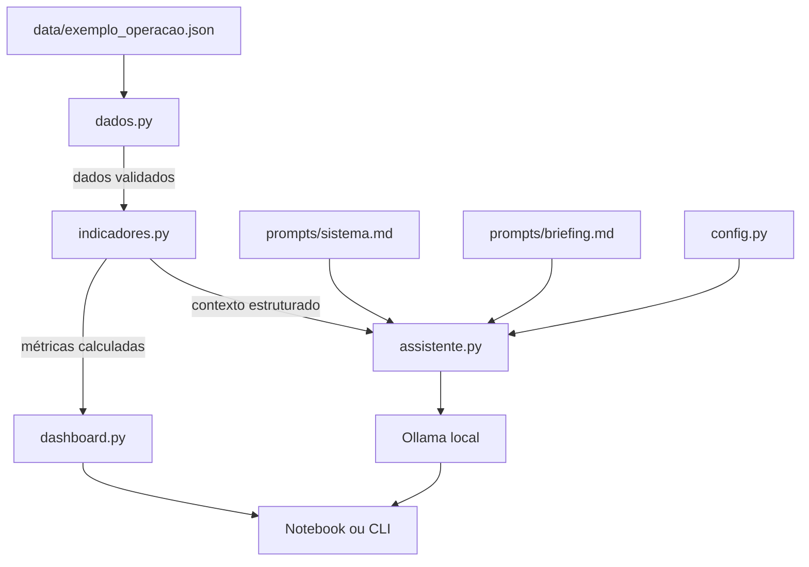

# Fluxo da estrutura

```mermaid
flowchart TD
    A[data/exemplo_operacao.json] --> B[dados.py]
    B -->|dados validados| C[indicadores.py]
    C -->|métricas calculadas| D[dashboard.py]
    C -->|contexto estruturado| E[assistente.py]
    F[prompts/sistema.md] --> E
    G[prompts/briefing.md] --> E
    H[config.py] --> E
    D --> I[Notebook ou CLI]
    E --> J[Ollama local]
    J --> I
```
